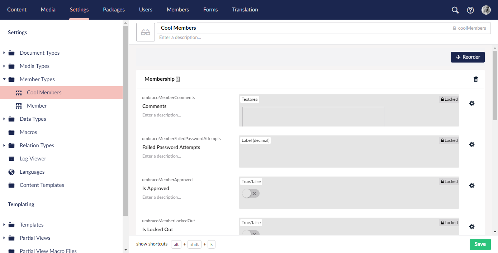
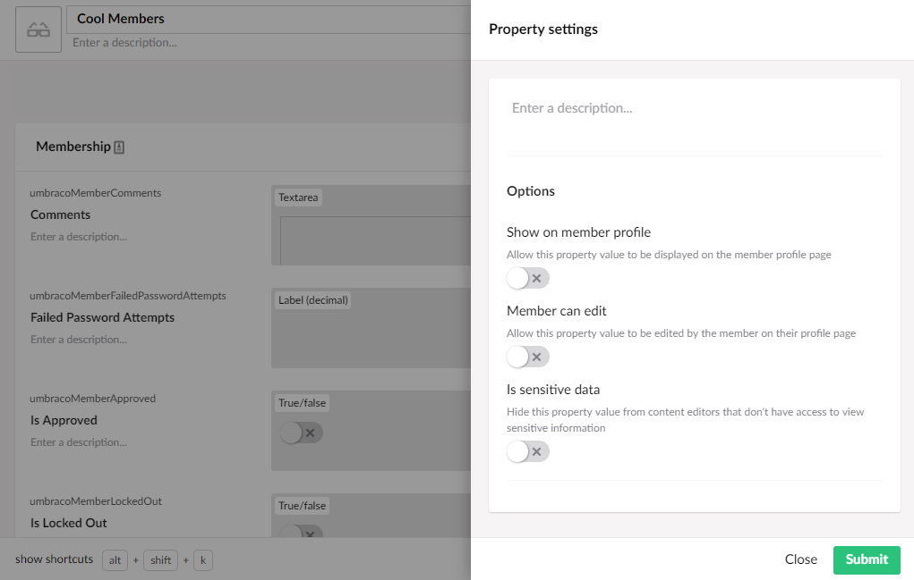
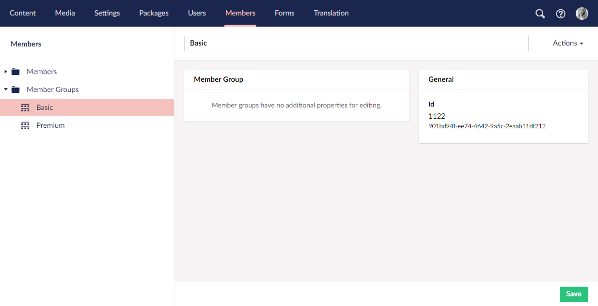
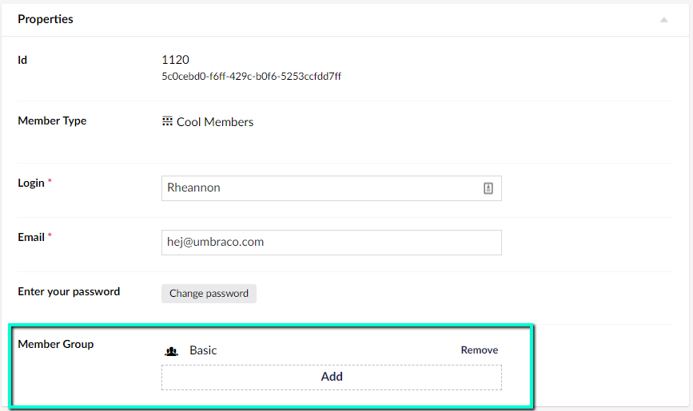

# Members
Members are used for registering and authenticating external users of an Umbraco installation (ie. forum members, intranet users and so forth). 

This guide will explain how to define and create members in the backoffice. If you want to work with members using the service APIs, links can be found at the end of the document.

There is a default Member Type that can be used to create members. You can, of course, customize it to fit your needs or create your own Member Type from scratch.

## Creating a Member
Go to the __Members__ section, right-click __Members__ in the member tree, click __Create__ and choose Member.

Members have a number of mandatory properties. So aside from filling out the name, you will need to fill out  __Login__, __Email__ and the two __Password fields__ in the __Properties__ group before a member can be saved.

There is also a number of default properties in the __Membership__ group:

- umbracoMemberComments
- umbracoMemberFailedPasswordAttempts
- umbracoMemberApproved
- umbracoMemberLockedOut
- umbracoMemberLastLockoutDate
- umbracoMemberLastLogin
- umbracoMemberLastPasswordChangeDate

Once the Member is created and saved you can access it by expanding the Members tree and clicking __All Members__ to get a list view. You can also view members of a specific type by selecting the member type in the Members tree.

## Creating a Member Type
You can create your own Member Types and add properties and tabs just as with Document Types.

Go to the __Settings__ section, right-click __Member Types__ and select __Create__. You will now be taken to the Member Type editor that is used to define and edit the Member Type. Name the new Member Type and click __Save__.

You will see that the __Membership__ group is added automatically to any Member Types you create. This group includes all the default Member Type properties listed above. The properties are locked, which means you cannot remove them, but you can still configure the settings for each property:

It is possible to add more groups and more properties to each of the Member Types you create, as well as the default Member Type.

## Creating Member Groups
Member Groups define roles for your members that can be used for role-based protection. A member can be in multiple groups.

To create a new Member Group click the menu icon next to the __Member Groups__ node in the Members section. Choose __Create__, name the group, and save the group.

### Assigning a Member Group
To assign a member to a specific group find the member you wish to assign and find the __Properties__ group. Here you can see which groups the member is already part of, as well as add the member to more groups or remove the member from already assigned groups:

# Sensitive data
You will have the option to mark member properties as sensitive. Sensitive properties on a members data will not be displayed to backoffice users unless they have appropriate permissions.

More information can be found under [security](../../../Reference/Security/#sensitive-data).

# Technical
As a developer you are able to leverage your website easily when you build on the Members section of Umbraco.
Although the Members section is by default in the Umbraco backoffice, you will be able to implement some work on the front end of your website.
Members come from a custom ASP.NET membership provider, while Member Groups come from a custom Role provider. Both are defined in the `web.config`.
You can find out more about the services methods in the reference section of the documentation by following the links below.

### More information
- [Customizing Data Types](../Data-Types/)

### Related Services
- [MemberService](../../../Reference/Management/Services/MemberService.md)
- [MemberType Service](../../../Reference/Management/Services/MemberTypeService.md)
- [MemberGroup Service](../../../Reference/Management/Services/MemberGroupService.md)

### [Umbraco.TV](https://umbraco.tv)
- [Chapter: Members](https://umbraco.tv/videos/umbraco-v7/content-editor/administrative-content/members/what-is-a-member/)
- Member API chapter *(Coming soon)*
